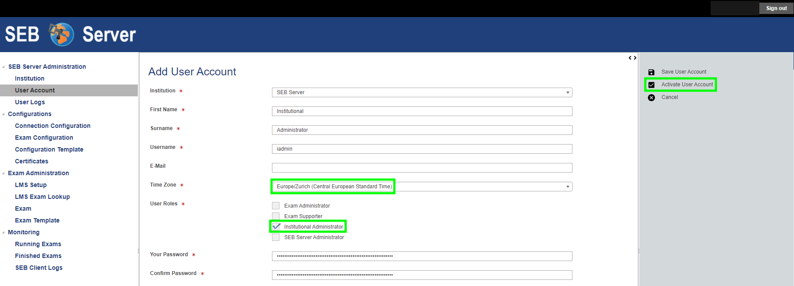
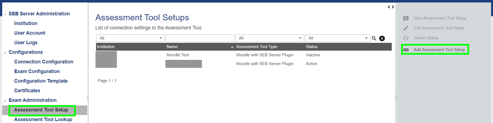
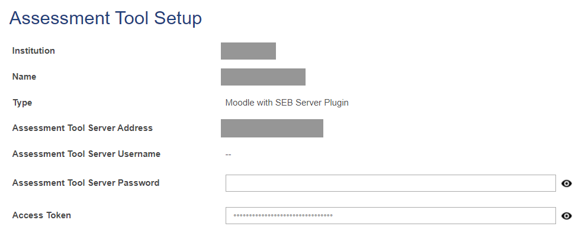
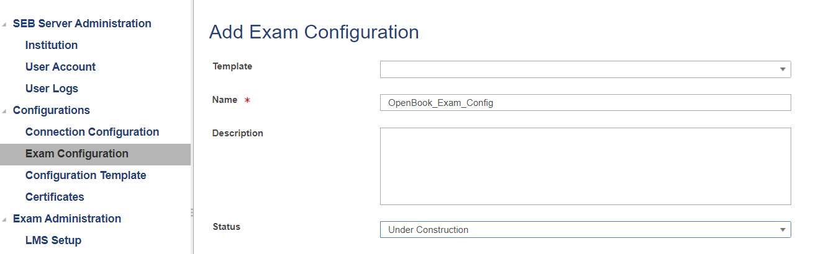
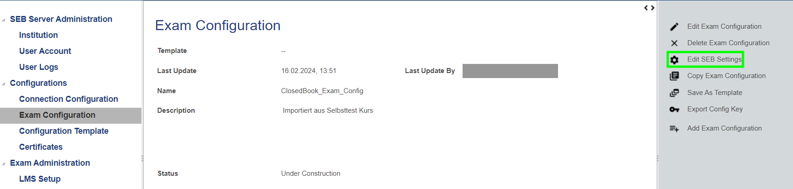
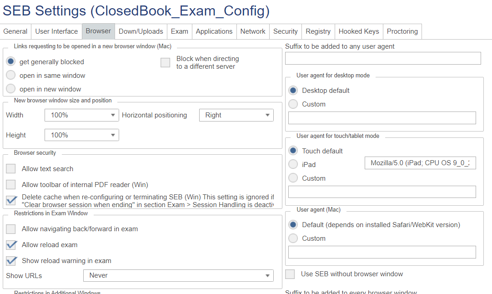
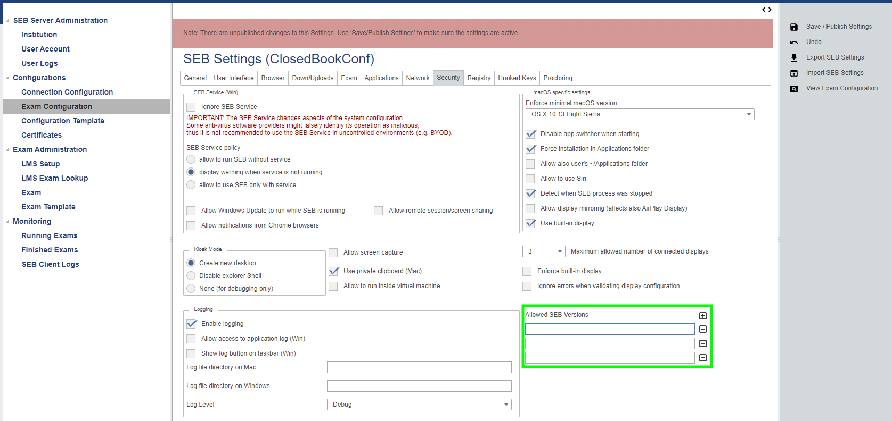
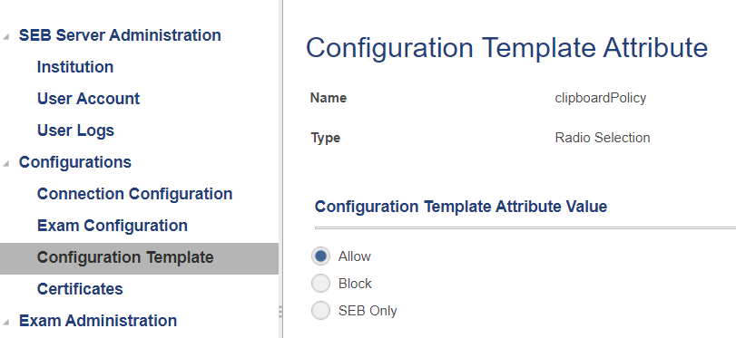
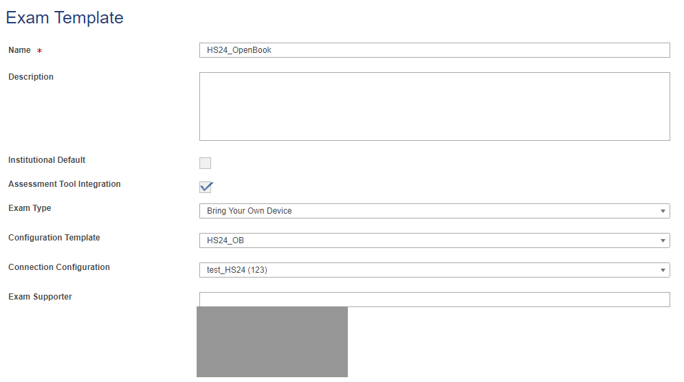
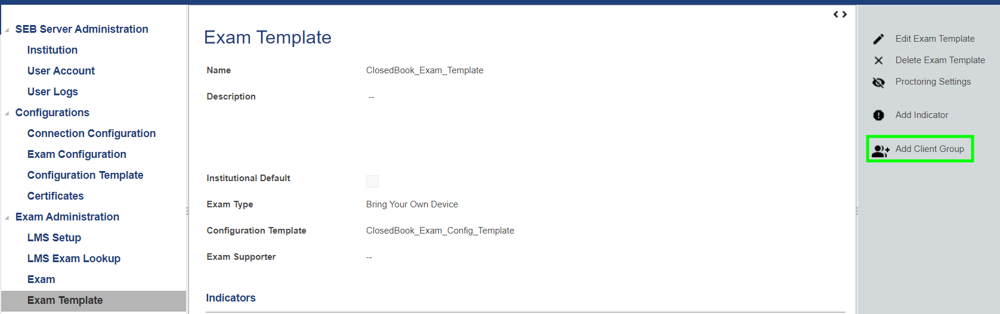

# 4. SEB Server Setup (Web UI)

[← Back to overview](../README.md) · Previous: [3. Moodle Setup](03-moodle-setup.md)

## Add an institution

First, add an institution in the SEB Server web UI.

## Create a user

Create a user with the role **Institutional Administrator** — this user is needed to set up the LMS connection. Make sure to select the correct institution.

## Add the LMS setup

Add a new LMS setup with the Moodle URL and the credentials (or access token) of the Moodle `sebserver` user created above. The user must be authorised for the web service and have the required Moodle permissions (see [3. Moodle Setup](03-moodle-setup.md)).

## Exam Configuration

Create an Exam Configuration once. Alternatively, it can be imported from an existing SEB config file, so it does not have to be configured from scratch.

Once a configuration is selected, the SEB settings can be edited (similar to the SEB client configuration tool).

On the *Security* tab, the allowed SEB versions can be restricted (minimum SEB client version):

The configuration must be marked as **Ready To Use**, then it can be saved as a template.

## Configuration Template

Created from the Exam Configuration. Individual attributes (e.g. the clipboard policy) can be adjusted per template:

## Exam Template

Now create an Exam Template (selecting the Configuration Template).

Optionally, client groups (e.g. per operating system) can be added.

---

Next: [5. Creating an Exam →](05-creating-an-exam.md)
