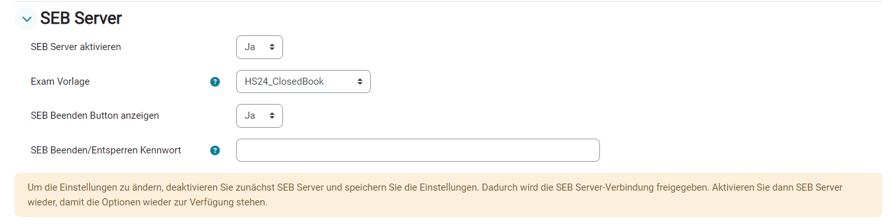
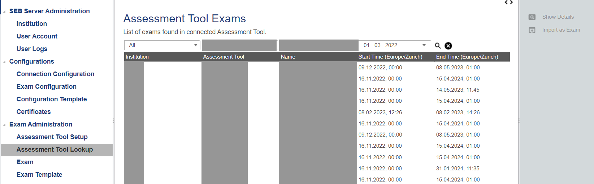
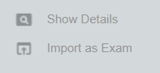
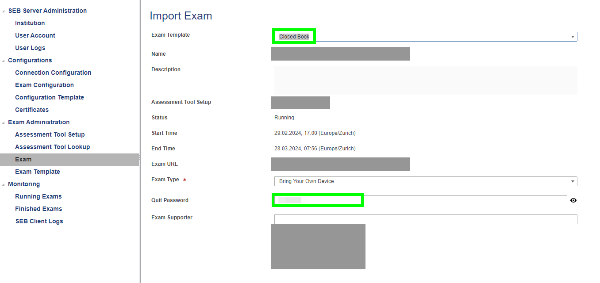
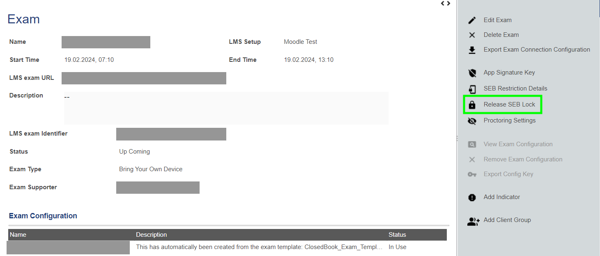
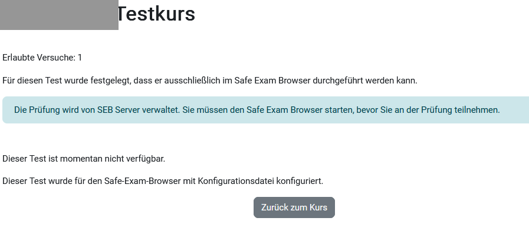
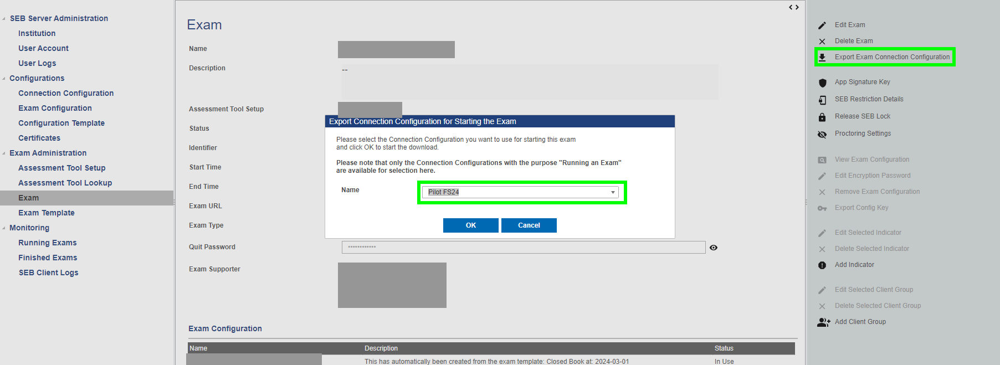

# 5. Creating an Exam

[← Back to overview](../README.md) · Previous: [4. SEB Server Setup (Web UI)](04-seb-server-webui.md)

## Add an exam

**Variant 1 — from Moodle:** in the Moodle quiz settings, open the *SEB Server* tab, enable the SEB Server and select the desired exam template.

**Variant 2 — import in SEB Server:** under *Assessment Tool Lookup*, search for the short course name and import the exam.

During import, select the previously created Exam Template. Since SEB Server v1.6, the quit password inherited from the template can also be changed at this point.

## Prepare the exam

A **SEB lock** can be enabled so the quiz can only be started with the Safe Exam Browser. When enabled, a button to close SEB after finishing the quiz is also shown.

In Moodle, the locked quiz looks like this for students:

## Export the config

To export the connection configuration, click **Export Exam Connection Configuration** in the exam and select the Connection Configuration from the dropdown. Upload the exported file to the Moodle course (and hide it from students as needed).

---

Next: [6. Useful Notes →](06-useful-notes.md)
